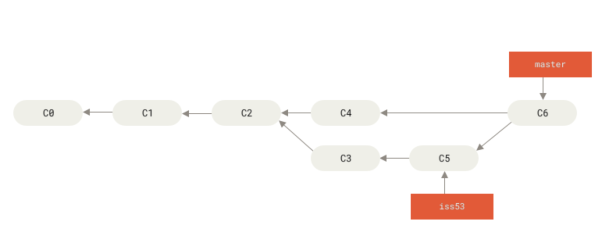
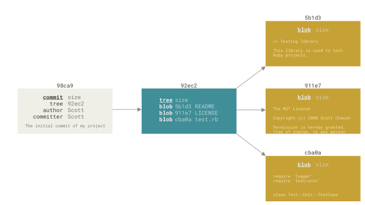
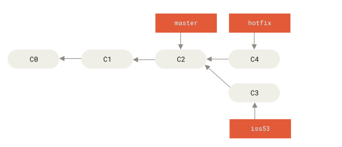

# 介绍

GIT是分布式版本管理工具，分布式体现在每个开发者的本地仓库都包含完整的版本库内容（仓库文件和变更历史），相当于一个独立的备份；GIT分为分为工作区、暂存区和版本库，协作开发模式下还会有一个远程仓库

GIT的存储结构如下图所示，每次提交（commit或merge）都会在提交树上生成一个新的节点（也就是一个版本），节点指向一个目录树，目录树包含了该版本所有文件的目录以及文件对应的blob引用（实际文件被压缩为blob，blob计算sha-1哈希值作为该文件的引用，这样既保证了引用的唯一性，也可以防止文件被篡改）

GIT每次提交或者merge会在目录树中新增一个提交节点，提交节点只包含的提交人、提交时间、commitid等字段信息，所以GIT提交是轻量的；GIT的分支就只是一个commitid，代表分支当前版本，所以GIT的分支也是轻量的；提交和新建分支的操作都很轻量，GIT是鼓励频繁提交和多建分支的

git合并分为快速合并（fast-forward merge）和三方合并(three-way merge)；下图master合并hotfix会执行快速合并，master由c2移动到c4即可，hotfix合并iss53则需要执行三方合并，c3、c4的共同最近祖先c2作为base版本，根据文件在c3、c4的变化情况执行合并（具体合并策略下表）

| Base版本 | Our版本 | Their版本 | 处理方式         |
| ------ | ----- | ------- | ------------ |
| A      | A     | B       | 自动采用 B       |
| A      | B     | A       | 自动采用 B       |
| A      | B     | C       | 尝试自动合并       |
| A      | B     | B       | 自动采用 B       |
| A      | B     | 删除      | 冲突（修改 vs 删除） |

# 常用命令

1. git --version 查看版本

2. git init 将当前目录交给git管理，执行add并commit后生成版本库

3. git log 查看分支提交记录
   
   1. git log 查询当前分支的提交记录，git log dev 查询dev分支的提交记录
   
   2. git log --filepath 查询filepath相关的提交记录，这里要写完整路径，可以配合fing ./ -name 使用，先查询到文件完整路径；git show commitid --filepath查询该文件在某个提交的变更信息

4. git branch
   
   1. git branch 查询所有分支信息；git branch -a 包含远程跟踪分支
   
   2. git branch branch-name 新建分支
   
   3. git branch -d branch-name 删除分支
   
   4. git branch -a查询远程分支origin/branchname，然后使用git checkout branchname即创建本地分支branchname，它会自动映射到origin/branchname

5. git status 查询工作目录和暂存区的当前状态。会显示新增未add的文件（untracked file），修改未add文件（not staged for commit），add未commit的文件（changes to be commited）

6. git remote 列出所有的远程分支（只包含名称）
   
   1. git remote -v 列出远程分支，包含url
   
   2. git remote add 名称 url  添加远程分支

7. git reflog 查看操作记录（就是在本地执行命令的历史记录）

# 撤销和回退

1. git reset --mode commitid 版本回退，该命令在合作分支上慎用，因为会重写历史，导致其他开发者需要同步，可能会有冲突，未push之前就没关系
   
   1. git reset --soft commitid 只修改HEAD为commitid，工作区和暂存区不变（重新commit后还原）
   
   2. git reset --mixed commitid 默认mode，修改HEAD和暂存区，工作区不变（需要add并commit后还原）
   
   3. git reset --hard commitid 修改HEAD、暂存区和工作区，任何未提交的内容将被丢弃（已提交的可以通过reflog找到提交那次的commitid，再通过git reset命令还原回来，没提交的就没办法找回了，另外reflog保存时间有限，太久的会被清除）；使用git reset --hard HEAD 放弃未提交的所有内容

2. git checkout 指定文件回退，恢复工作区的某个文件（该文件如果修改未提交，修改部分将会丢失）；完整命令：git checkout commitid --filepath (filepath可通过find ./ -name 命令查)

# 贮藏

通过git stash命令暂时保存当前工作区的修改到一个堆栈中，可以随时恢复

## 保存当前工作状态

1. git stash 默认将提交信息作为描述信息

2. git stash push -m "描述信息"  手动添加描述信息

## 查询贮藏区

1. git stash list 查询贮藏堆栈列表

2. git stash show stash@{n} 查询指定贮藏记录包含的变更文件

## 恢复贮藏内容

1. git stash apply 恢复最近一次贮藏，仍然保留该贮藏记录

2. git stash apply stash@{n} 恢复指定一次的贮藏记录

3. git stash pop 恢复并删除贮藏记录

## 删除贮藏记录

1. git stash drop 删除最近一次贮藏记录

2. git stash stash@{n} 删除指定贮藏记录

3. git stash clear 删除所有贮藏记录
